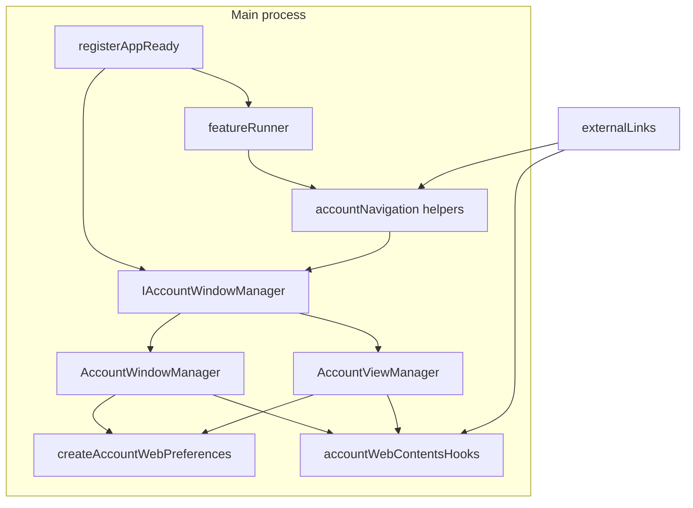

# deep-enhancements — Design Document & Work Plan

| Field | Value |
| --- | --- |
| **Title** | GogChat Deep Enhancements |
| **Author** | TBD |
| **Date** | 2026-07-31 |
| **Status** | **Mostly implemented** (rev 5 — post-review gap fixes; residual measurement/smoke blocked) |
| **Version baseline** | 3.18.1 → **shipped in tree: 3.18.2** (Wave 4 closeout product + identity) |
| **Branch context** | `deep-perf-enhancements` (product Waves 1–4 largely landed; Wave 3 matrix/auth/signed smoke still blocked) |
| **Repository** | https://github.com/iWorkforces/GogChat (canonical; not OCWorkforces) |
| **Related plans** | `docs/plans/performance-remediation.md` (Todos 8–9 still measurement-blocked), `docs/plans/native-os-notifications.md`, `docs/plans/macos-intel-x64-dmg.md` |
| **Evidence root** | `.omo/evidence/deep-enhancements/` (primary for this plan); performance matrix/candidate receipts also linked into `.omo/evidence/performance-remediation/` — see **Plan relationship** |
| **Revision** | rev 4 adds end-of-plan **v3.18.2** version bump + full **AGENTS.md** hierarchy refresh; rev 3 resolves Open Q1–Q3; rev 2 addressed design-review Issues 1–20 |

---

## TL;DR (For humans)

**What you'll get:** A dual-backend-correct multi-account contract (honest WCV state machine, WebContents-first navigation, multi-account navigation guards), security hygiene that matches Chromium TLS trust, non-blocking first-run media TCC, truthful docs/CI/integration assertions, and an evidence path that **consumes** performance-remediation measurement protocols to finish Todos 8–9 and notification Phase-2 go/no-go — without flipping product defaults on speculation.

**Why this approach:** Multi-agent analysis shows the largest remaining risk is not missing features; it is **contract drift** (BrowserWindow vs WebContentsView callers, dehydrate≡hidden, account-0-only feature attachment), **evidence stalls** (matrix/candidates historically empty or NO CHANGE; auth secrets; unread-delta default false), and **truth gaps** (stale README cert-pinning claim, notarize `bundleId` typo + productFilename coupling, coverage ghosts, integration test expecting `webSecurity: false`, Windows hard-gate on mac-only publish). Fix truth and contracts first; measure next; productize only when thresholds pass.

**What it will NOT do:** It will not reintroduce certificate pinning, flip WebContentsView to default, claim package bytes as startup wins, treat `account-0-ready` / content-loaded as first paint/interaction, double-`loadURL` on BW hydrate, hand-edit `featurePlan.ts`, weaken sandbox/contextIsolation, declare Windows public support, change **when** WCV accounts are destroyed vs parked (only API honesty), or invent parallel CHANGE decisions outside remediation thresholds.

**Effort:** Large  
**Risk:** Medium–High — multi-account API surface, security handlers, release gates; mitigated by wave ordering (truth → contract → measure → decide), conformance suites, explicit teardown protocol, and per-PR rollback.  
**Owner decisions (final):** (1) Keep all-four publish gate (mac arm64+x64 + Windows x64+arm64) — no mac-only decoupling. (2) Never dehydrate account-0 under memory pressure (Wave 4 P25 approved). (3) Unread-delta default stays false until Phase-2 smoke; green smoke **unblocks consideration** of default true (not automatic) via explicit decision receipt. (4) Plan **closeout:** bump to **v3.18.2** and refresh **all** `AGENTS.md` files after final verification.

Your next move: execute via `/execute-plan` or a dedicated implementation session. Full execution detail follows.

---

> TL;DR (machine): Large; Mostly implemented @ v3.18.2; residual gap-fixes applied (WC-first externalLinks/deepLink, BW hydrate hooks, WCV unthrottle/fallback, mediaTypes unknown deny); Wave 3 matrix/auth/signed smoke still blocked; unread-delta default false until Phase-2; no WCV default flip; no cert pinning.

---

## Overview

GogChat is a macOS-first Electron wrapper for Google Chat (`https://mail.google.com/chat/u/0`). It already has dual Rsbuild (ESM main + CJS sandboxed preload), build-time feature planning from `src/main/initializers/*.spec.ts` → `src/main/generated/featurePlan.ts`, dual multi-account backends (default BrowserWindow; opt-in WebContentsView via `app.useWebContentsView`), native notification bridge, and a performance remediation program whose **measurement** lanes remain incomplete.

This document is an **execution-oriented design** for the next depth of work: make dual-backend behavior honest and testable; close security and packaging truth gaps; unblock measurement; then productize only behind thresholds. It is written so engineers and agents can implement without re-interviewing, with agent-executable acceptance criteria and a concrete PR order.

**Rev 2** hardened Wave 2 contracts and Wave 1 acceptance. **Rev 3** locks owner Open Q1–Q3: keep all-four publish gate; never dehydrate account-0 under pressure (P25 approved); unread-delta default-true only after green Phase-2 smoke **and** explicit decision receipt (consideration unblocked, not automatic). **Rev 4** adds mandatory plan closeout: **v3.18.2** version bump and full **AGENTS.md** hierarchy refresh after final verification.

---

## Plan relationship (performance-remediation & notifications)

| Plan | Owns | This plan does |
| --- | --- | --- |
| `docs/plans/performance-remediation.md` | Metric contract, budget, lifecycle fixes, package closure, **Todo 8 matrix protocol**, **Todo 9 candidate thresholds** | **Consumes** Todo 8/9 scripts and thresholds unchanged. Wave 3 **executes** matrix + candidates **after** dual-backend contract honesty. |
| `docs/plans/native-os-notifications.md` | Permission probe, bridge, multi-account focus, Phase 2 unread-delta gate | Complements with WCV focus-gate fix + smoke evidence; default stays false until Phase-2 receipt **and** follow-up product decision (green smoke may unblock default **true** if bridge insufficient) |
| `docs/plans/macos-intel-x64-dmg.md` | Dual DMG packaging | Unchanged; **Open Q1 resolved: keep all-four aggregate publish gate** (no mac-only decoupling) |

### Evidence handoff protocol (mandatory)

1. **Primary write root for this plan:** `.omo/evidence/deep-enhancements/`.
2. **For matrix (remediation Todo 8) and candidates (Todo 9):** also write (or hard-link / copy) the same receipt files into `.omo/evidence/performance-remediation/task-8-*` and `task-9-*` **or** write a pointer receipt:
   ```json
   {
     "plan": "performance-remediation",
     "todo": 8,
     "status": "completed|blocked",
     "canonicalEvidence": ".omo/evidence/deep-enhancements/task-w3-1-matrix-*.json",
     "thresholds": "unchanged-from-performance-remediation.md"
   }
   ```
3. **Thresholds and scripts are pinned** to remediation:
   - Matrix: `scripts/account-backend-benchmark.js` (and its contract tests)
   - Candidates: `scripts/performance-candidate-benchmark.js` — ≥20 valid pairs, ≥10% median primary, ≤5% p95 regression, invariants
4. **Forbid parallel conflicting CHANGE decisions:** product code CHANGE for a candidate may land only once; the decision receipt must be referenced from both plans. Agents must not re-run Todo 9 under remediation with different thresholds while this plan is in flight.
5. **Historical “0 valid pairs”** is analysis-sourced (multi-agent synthesis + harness-first design of the benchmark). This plan does **not** claim a committed matrix receipt already in-repo proves zero; Wave 3 produces the first durable dual-root receipts (or blocked reasons).

---

## Background & Motivation

### Current architecture (relevant facts)

```text
index.ts (thin)
  → enforceSingleInstance, setupDeepLinkListener, registerAppReady, registerShutdown
registerAppReady
  → security phase (reportExceptions, mediaPermissions)  // media awaits TCC today
  → critical + config store
  → preconnect (GOGCHAT_DISABLE_PRECONNECT=1 kill switch)
  → account-0 window + feature context + performanceFinalizer
  → UI phase → setImmediate deferred phase (tray/menu/badges/…/cdpTelemetry in first batch)
IAccountWindowManager
  → AccountWindowManager (default BW) | AccountViewManager (opt-in WCV host)
  → when WCV: accountManagerSingleton === getAccountViewManager() instance
```

Key contracts already documented in root `AGENTS.md` and `src/main/utils/account/AGENTS.md`:

- Feature specs only via `*.spec.ts`; never hand-edit `featurePlan.ts`.
- Memory unit **MB** end-to-end; finalizer owns export.
- Do not treat `account-0-ready` / content-loaded as first paint/interaction.
- BW factory owns single restored `loadURL` on hydrate; manager must not re-dispatch.
- Chromium is sole TLS trust; no custom `certificate-error` listeners.
- BrowserWindow remains default backend until measured matrix + explicit decision.
- Preserve account 0 and bootstrap accounts during dehydration (root AGENTS + account AGENTS).
- Do **not** change WCV hide/throttle/destroy **resource policy** without controlled evidence — see **Compatible amendment** below.

### Compatible amendment to account AGENTS / performance-remediation (Wave 2 scope)

| In scope (contract honesty) | Out of scope until Wave 4 / owner + evidence |
| --- | --- |
| Split API meanings: `isDehydrated` ≠ “not frontmost” | Changing **when** accounts are destroyed (BW) vs parked (WCV) |
| Add `isAccountVisible` + internal `resourceState` | Flipping default backend to WCV |
| Same hide/throttle **mechanisms** as today for dehydrate-park | Destroying WCV views on dehydrate (would be policy change) |
| Tests that freeze current transition *triggers* (Wave 2) | —; **Wave 4 P25 approved:** never dehydrate account-0 under pressure |

**Amendment text for implementers:** Wave 2 is a **contract honesty** change: names and predicates must match reality so router, close-to-tray, pressure, and sampling stop mis-classifying “switched away” as “dehydrated.” It is **not** a policy flip of default backend or of destroy-vs-hide resource behavior. Agents must not refuse Wave 2 solely because account AGENTS forbids “semantic changes” — honesty of `isDehydrated` is explicitly authorized here; **resource policy** changes are not.

### Pain points (evidence-based synthesis)

#### Theme A — Evidence-gated decisions still stalled

| Item | State | Source |
| --- | --- | --- |
| BW/WCV matrix (perf Todo 8) | Harness exists (`scripts/account-backend-benchmark.js`); durable dual-backend valid-pair matrix still missing / blocked for policy | `performance-remediation.md` Todo 8 |
| Candidate benches (Todo 9) | preconnect, CDP, unread, timers, split-chunks → prior runs **NO CHANGE** / empty pairs | `performance-candidate-benchmark.js` |
| Auth first-interaction | Credential-isolated harness; blocked without secrets | remediation |
| Notification Phase 2 | Unread-delta default **false**; signed smoke / go-no-go open | `native-os-notifications.md` |

#### Theme B — Dual-backend architecture correctness

Callers still treat `getAccountWindow()` as “the account document”:

| Call site | Problem on WCV |
| --- | --- |
| `externalLinks.ts` | `window.webContents` / `loadURL` → **host**, not child view document; secondary accounts never get handlers on BW either |
| `deepLinkHandler.ts` | `windowRef.loadURL` / `getURL()` on host |
| `bootstrapWatcher` / bootstrap promotion paths | Window-centric navigation |
| `appMenu.ts` | Sign-out, search, URL, history use constructor-bound account-0 window; slot loops may use size-based indices |
| `registerAppReady.ts` content-loaded | Listens `mainWindow.webContents` — host empty shell under WCV |
| WCV `isDehydrated` | `return !entry.isVisible` — **semantic lie** (hidden-live ≠ dehydrated-parked) |
| Account-0 dehydrate | BW **blur timer** protects 0; BW **memory-pressure** can dehydrate 0 (`accountSessionMaintenance` + tests); WCV **never** dehydrates 0 — pressure path already conflicts with AGENTS “preserve account 0” |
| Feature attachment | Deferred features take `mainWindow` only — secondary accounts miss `externalLinks` (passkeys are global IPC — see KD13) |
| Shared renderer factory | `windowWrapper.ts` vs WCV reimplementation drifts |
| Singleton destroy | `destroyAccountWindowManager()` nulls `accountManagerSingleton` only; does **not** null `accountViewManager` module singleton after WCV `destroyAll` |
| Dense loops | `closeToTray.ts` / `shutdownDiagnostics.ts` loop `0..getAccountCount()-1` — wrong under sparse indices (`Map.size` ≠ maxIndex+1) |

#### Theme C — Critical path / startup

- `mediaPermissions` is in **security** phase and `await`s TCC → blocks ready chain before windows.
- Deferred first batch races Chat document load (`cdpTelemetry` shares first deferred batch with tray/bootstrap/passkeys — generated plan).
- Preconnect kill switch exists; host-set changes need auth evidence (Todo 9).
- `perfMonitor.recordIpcLatency` exists; production IPC path largely does not call it (**non-goal** this plan — Open Q4 resolved: no).
- V8 heap cap and account-0 background-throttling split already landed — preserve.

#### Theme D — Security hardening

| Issue | Location |
| --- | --- |
| `embeddingOrigin` OR-trust too loose | `permissionHandler.ts` |
| Empty `mediaTypes` grants media | `granted = true` then only checks listed types |
| Request handler always passes `undefined` as first origin arg | trust only from `details.*` fields |
| `will-navigate` weaker than `setWindowOpenHandler` (no non-HTTP early reject) | `externalLinks.ts` |
| Global 5-min external-links guard disable | tracked interval (already tracked) |
| About panel incomplete `webPreferences` (no `sandbox`) + unescaped HTML | `aboutPanel.ts` |
| Residual `disableCertPinning` API + **README false claim** | `secureFlags.ts`, `README.md` |
| Notification icon any `http(s)`/`data` via `validateFaviconURL` | validators |

#### Theme E — Notifications UX residual

| Issue | Location |
| --- | --- |
| Unread-delta uses `focusWindow.isFocused()`; WCV `getAccountWindow` is host → suppresses all accounts when host focused | `badgeHelpers.ts` + `notificationFocus.ts` |
| Permission flag ≠ live grant | intentional Phase 1; residual product gap |
| Tray/badge multi-account edge cases | badgeHelpers / tray |
| Bridge install once; Chat may clobber `window.Notification` | **non-goal** this plan (see Non-goals) |

#### Theme F — Quality / packaging

| Issue | Location |
| --- | --- |
| Coverage excludes ghost `certificatePinning.ts` | `vitest.config.ts` |
| Integration expects `webSecurity: false` | `tests/integration/app-launch.test.ts` line ~31 |
| History doc claims current `webSecurity: false` | `docs/windowWrapper-history.md` |
| Playwright not in PR CI | `pr-check.yml` |
| `check:doc-claims` not on PR CI | `pr-check.yml` |
| `notarize.cjs` `com.ocworkforcess.${productFilename}` | typo **and** productFilename coupling |
| Apple password env name drift | docs vs `APPLE_APP_PASSWORD` |
| `lib/` dual writers | optional hygiene only |
| Windows hard gate requires all-four artifacts for publish | **Resolved Q1: keep all-four gate** (no mac-only ship) |
| Stale PERF claims | `PERFORMANCE_UTILITIES.md` |

### Why now

Performance remediation measurement lanes are blocked on truthful dual-backend behavior and credentials. Shipping candidates without Theme B fixes will sample the wrong WebContents. Security/docs items are independently shippable and reduce release risk (especially notarize identity).

---

## Goals & Non-Goals

### Goals

1. **Truth & safety (Wave 1):** Non-blocking media permissions (security phase, fire-and-forget); exact permission trust algorithm; empty mediaTypes deny; notarize identity; README/docs/integration webSecurity truth; coverage ghost + PR doc-claims; about-panel sandbox.
2. **Multi-account contract (Wave 2):** WebContents-first navigation helpers; full WCV three-state machine; required `isAccountVisible`; shared webPreferences; hook registry for WC-scoped guards (`externalLinks`); safe singleton destroy; sparse `listAccountIndices` (incl. appMenu audit); dual-backend conformance (router, pressure, close-to-tray, content-loaded).
3. **Measure then productize (Wave 3):** Matrix + candidates with dual-root evidence handoff; auth harness; unread-delta focus fix + smoke; deferred UI vs idle telemetry split; notification icon allowlist.
4. **Gated decisions + closeout (Wave 4):** Decision receipts; **P25 never dehydrate account-0 under pressure** (approved); unread-delta default flip only after Phase-2 smoke + decision receipt if bridge insufficient; final verification; **bump `package.json` version to 3.18.2**; **refresh all `AGENTS.md` files** to align with the post-implementation codebase (metadata: date, commit, branch, version 3.18.2; architecture claims; Wave 2 contract honesty). **No** mac publish decoupling (Q1).

### Non-goals (MUST NOT)

- Do **not** reintroduce certificate pinning or `certificate-error` listeners without a separate security plan.
- Do **not** flip `app.useWebContentsView` default without measured matrix + written decision receipt.
- Do **not** claim package-byte reduction as startup win.
- Do **not** treat `account-0-ready`, `did-finish-load`, or `account-0-content-loaded` as first paint or first interaction.
- Do **not** double-dispatch `loadURL` on BrowserWindow hydrate.
- Do **not** hand-edit `src/main/generated/featurePlan.ts` or reintroduce runtime feature registration.
- Do **not** weaken `contextIsolation: true`, `sandbox: true`, `nodeIntegration: false`, or CJS preload contract.
- Do **not** change memory unit away from MB; finalizer remains sole export owner for startup metrics.
- Do **not** declare Windows publicly supported without clean packaged smoke on Windows x64 and real Windows arm64.
- Do **not** decouple mac publish from the Windows artifact gate — `verify-release-artifacts` keeps the all-four requirement (Open Q1 resolved).
- Do **not** change preconnect/unread/CDP/timers/split-chunks product code without Todo 9 thresholds.
- Do **not** change WCV **resource policy** (destroy vs hide/throttle **when** parking happens) without Wave 4 + evidence — only API honesty in Wave 2.
- Do **not** implement production IPC latency wiring — **explicit non-goal** (Open Q4 resolved: default no).
- Do **not** implement notification bridge reinstall/clobber recovery in this plan — **explicit non-goal** (track under native-os-notifications follow-up if smoke shows Chat clobber).
- Do **not** expand coverage includes for currently excluded features in Wave 1 (separate measured PR later).
- Do **not** add `GOGCHAT_DISABLE_MULTI_ACCOUNT_GUARDS` kill switch — conformance tests are the safety net.

---

## Key Decisions

| ID | Decision | Rationale |
| --- | --- | --- |
| **KD1** | **WebContents-first free helpers** (`accountNavigation.ts`) + keep `getAccountWindow` for show/focus/bounds — do **not** put `loadURL/getURL/send` on `IAccountWindowManager` in this plan | Free functions stay thin, testable without growing interface surface; interface already has `getAccountWebContents` |
| **KD2** | **WCV three-state model** `visible \| hidden-live \| dehydrated-parked`; `isDehydrated` ⇔ dehydrated-parked only; `isAccountVisible` ⇔ visible | Fixes semantic lie without changing park mechanism (hide+throttle) |
| **KD3** | **Never dehydrate account-0 under memory pressure** (owner final) — Wave 2 freezes current BW pressure behavior in characterization tests; **Wave 4 / P25 implements** filter so pressure never calls `dehydrateAccount(0)` on either backend; blur timer and WCV already protect 0 | Aligns BW pressure with root AGENTS, blur policy, and WCV; badge/notification reliability |
| **KD4** | **mediaPermissions stays phase=`security` but init is fire-and-forget** — `init` schedules TCC via `createTrackedTimeout(0)` / `setImmediate` equivalent and **resolves immediately**; does **not** edit `deferred.spec.ts` in Wave 1 | Avoids deferred graph collision with W3-4; still runs early without blocking `runPhase('security')` |
| **KD5** | **Permission trust algorithm (exact)** — see §1.2 | Prevent embedding-only spoof; keep Meet for trusted Google requesting origins |
| **KD6** | **Empty or missing `mediaTypes` on media permission → deny** | Current default grant is unsafe |
| **KD7** | **Notarize `bundleId` is the literal `com.ocworkforces.gogchat`** (shared constant with appId); **stop** deriving from `productFilename` | Fixes typo and name/case drift |
| **KD8** | **No WCV default flip in this plan** | Honors remediation guardrail |
| **KD9** | **Unread-delta default stays `false` until Phase-2 signed smoke + explicit product decision receipt.** Green smoke **unblocks consideration** of default `true` **only if** evidence shows Chat bridge is insufficient when unfocused; if bridge is sufficient, keep default false. No automatic flip without a written Wave 4 decision receipt | Owner Q3: measure-first; allow default-true consideration after green smoke when bridge falls short |
| **KD10** | **Evidence dual-root handoff** — deep-enhancements primary; pointer or copy into performance-remediation for Todos 8–9 | Prevent dual-plan drift |
| **KD11** | **Keep all-four publish gate** — `verify-release-artifacts` continues to require both mac DMGs (arm64+x64) **and** both Windows NSIS installers before any publish. **P24 not approved — do not implement** mac-only decoupling | Owner Q1 final: no mac-only hotfix publish path |
| **KD12** | **Shared `createAccountWebPreferences(partition)` factory** | Prevents preload/sandbox/webSecurity drift |
| **KD13** | **Multi-account WC guards via module-level hook registry** `accountWebContentsHooks.ts`: `onAccountWebContentsCreated` / `off`; manager fires on every live account WC create and **backfills** existing accounts when a listener registers; **Wave 2 must-subscribe: `externalLinks` only**. Passkeys = global `defineIPC` — **no WC attach**. Cleanup: listener removes WC handlers on account unregister/destroy via returned disposer | One approach; avoids feature→feature imports; no thrash between migrate and attach PRs |
| **KD14** | **`isAccountVisible(accountIndex)` is required** on `IAccountWindowManager` (both backends) | Conformance simplicity; unread-delta focus gate needs it |
| **KD15** | **Singleton teardown protocol** — see §2.5; never double-`destroyAll` unsafely | Fixes WCV module singleton leak without double-destroy |

---

## Proposed Design

### Architecture target



### Wave model

```text
Wave 1 Truth & safety  ──► Wave 2 Multi-account contract ──► Wave 3 Measure ──► Wave 4 Decide
         │                         │                              │
         │                         └── conformance suite ─────────┤
         └── media fire-and-forget (no deferred.spec edit)        └── deferred split (W3)
```

---

### Wave 1 — Truth & safety

#### 1.1 Media permissions non-blocking (KD4)

**Today:** `SECURITY_FEATURES` includes `mediaPermissions` with `await checkAndRequestMediaAccess` for camera and mic. `registerAppReady` awaits `runPhase('security', context)` before windows.

**Target (locked):**

1. Keep feature name and **phase: `security`** in `security.spec.ts` (no W1 edit to `deferred.spec.ts`).
2. Change `mediaPermissions` default export so `init` / default function:
   - On non-darwin: return immediately (unchanged).
   - On darwin: schedule async work with `createTrackedTimeout(..., 0, 'media-permissions-tcc')` (or equivalent tracked immediate) that calls camera then mic checks; **return without awaiting** that work.
   - Errors in scheduled work: log only (existing catch pattern).
3. CI/headless: existing mediaAccess CI skip behavior preserved inside `checkAndRequestMediaAccess`.

**Must NOT:** Move media into deferred phase in W1; await TCC inside `runPhase`; remove requests entirely; touch cert pinning.

**Agent-executable acceptance (W1-1):**

```bash
# New/updated unit tests (not the mocked security.test no-op alone):
bun run test:run -- src/main/features/mediaPermissions.test.ts
```

Tests must:

1. Spy `checkAndRequestMediaAccess` with a deferred promise that never resolves in the same tick.
2. Assert `await mediaPermissions(context)` (or `runFeature` equivalent) **resolves in the same macrotask chain** while the spy has been **scheduled** but **not** yet settled.
3. Flush tracked timers / resolve spy and assert both camera and mic were requested on darwin.
4. Assert non-darwin skips.

Optional smoke: headless still completes export contract when network allows — **not** the primary gate.

#### 1.2 Permission trust algorithm + empty mediaTypes (KD5/KD6)

**Exact trust function (request + check handlers must agree):**

```text
function isTrustedRequestingOrigin(requestingOriginArg, details):
  candidates = ordered unique non-empty:
    1. requestingOriginArg          // check-handler's requestingOrigin string
    2. details.requestingUrl        // full URL → origin
    3. details.securityOrigin       // origin string or URL
  // NEVER use details.embeddingOrigin for allow decisions
  return any(candidate origin ∈ TRUSTED_PERMISSION_ORIGINS)

TRUSTED_PERMISSION_ORIGINS =
  https://accounts.google.com
  https://chat.google.com
  https://mail.google.com
```

**Media request path:**

```text
if permission === 'media':
  mediaTypes = details.mediaTypes ?? []
  if mediaTypes.length === 0:
    log.warn empty-media-types
    callback(false); return
  granted = true
  if 'video' in mediaTypes: granted &&= await TCC(camera)
  if 'audio' in mediaTypes: granted &&= await TCC(mic)
  // unknown media type strings: ignore for grant bits but do not auto-grant empty
  callback(granted)
```

**Request handler today** calls `isTrustedPermissionOrigin(undefined, details)` — after change, still OK if algorithm uses details fields 2–3 only (never embedding). Prefer also reading Electron `details.requestingUrl`.

**Red tests (must fail before fix):**

1. Untrusted `requestingUrl` + trusted `embeddingOrigin` → **deny**.
2. Empty `mediaTypes` → **deny**.
3. Trusted `https://mail.google.com` + `mediaTypes: ['video']` + TCC mock grant → **grant**.
4. Same for chat.google.com / accounts.google.com + audio.

**Manual residual:** Meet/Huddle on signed build if CI cannot exercise real frames — record in evidence as release residual, not CI hard fail.

#### 1.3 Notarize identity + env doc alignment (KD7)

**File:** `scripts/notarize.cjs`

```js
// BEFORE (broken):
// bundleId: `com.ocworkforcess.${appName.toLowerCase()}`,

// AFTER:
const NOTARIZE_BUNDLE_ID = 'com.ocworkforces.gogchat';
// use NOTARIZE_BUNDLE_ID only — do NOT derive from productFilename
```

**Constant source of truth strategy (concrete):**

1. Add `scripts/app-identity.cjs` (or top of notarize.cjs) exporting `APP_ID = 'com.ocworkforces.gogchat'`.
2. Unit test `scripts/notarize-identity.test.js` (or extend package-scaffold tests):
   - `require`/`fs.readFileSync` assert source contains exact `com.ocworkforces.gogchat` and does **not** contain `com.ocworkforcess` or `` `com.ocworkforces.${ `` template from productFilename.
   - Assert equality with a duplicated expected string that matches `src/shared/appIdentity.ts` appId (test reads both files or hardcodes single expected).
3. Docs: standardize on **`APPLE_APP_PASSWORD`**; fix `docs/macOS-Code-Signing-Guide.md` if it still says `APPLE_APP_SPECIFIC_PASSWORD` without alias note. Code does **not** need dual-read unless owner wants — prefer one name.

**Acceptance:**

```bash
bun run test:run -- scripts/notarize-identity.test.js   # or chosen path
bun run check:doc-claims
# grep -n 'ocworkforcess' scripts/notarize.cjs → no matches
```

#### 1.4 Docs + integration webSecurity truth

| Artifact | Fix |
| --- | --- |
| `README.md` | Remove “Certificate pinning for Google domains…” claim |
| `docs/windowWrapper-history.md` | Historical narrative OK; add **Current (code):** `webSecurity: true` in `windowWrapper.ts`; do not claim current is false |
| `src/main/utils/PERFORMANCE_UTILITIES.md` | Remove unsubstantiated 17–35ms / stale cert-pinning-done claims; point to remediation evidence or delete numbers |
| `tests/integration/app-launch.test.ts` | `expect(security.webSecurity).toBe(true)` — match product |
| Secure flags comments | Residual `disableCertPinning` storage-compat only |

#### 1.5 Coverage ghost + PR check:doc-claims (scoped)

**Wave 1 only:**

1. Remove exclude entry `src/main/features/certificatePinning.ts` from `vitest.config.ts`.
2. Add step to `.github/workflows/pr-check.yml`: `bun run check:doc-claims` after typecheck or with quality steps.

**Explicitly not in Wave 1:** re-including `aboutPanel.ts`, `externalLinks.ts`, `closeToTray.ts`, etc. into coverage — those remain excluded so thresholds 94/92/94 stay green. Optional later PR: measured include expansion with threshold strategy.

#### 1.6 About panel

- `webPreferences`: `sandbox: true`, `contextIsolation: true`, `nodeIntegration: false`.
- Escape `productName`, `version`, `author`, `platform` (HTML entity escape).
- Tests in `aboutPanel.test.ts` assert sandbox + escape (unit tests exist path even if coverage exclude remains).

#### 1.7 External links will-navigate parity (minimal)

- Prefer tests first; code fix if red.
- **Acceptance must include:** when guard **enabled**, non-HTTP `will-navigate` is prevented (align with window-open early reject). Red then green if code change needed.
- 5-min guard remains; document; no removal in Wave 1.

---

### Wave 2 — Multi-account contract

#### 2.1 WCV account state machine (KD2) — full spec

**Internal enum** (implementation name free; semantics fixed):

| State | Meaning | Renderer | Layout |
| --- | --- | --- | --- |
| **visible** | Frontmost account UI | Unthrottled per account-0 rules; focused WC when host focused | On-screen bounds |
| **hidden-live** | Account alive but not frontmost (user switched away) | May keep prior throttle policy for non-0; **still a live session** | Off-layout / not painted as front |
| **dehydrated-parked** | Resource park: hide + `setBackgroundThrottling(true)` via `dehydrateAccount` | Throttled; partition preserved | Off-layout |

**API mapping:**

| API | true when |
| --- | --- |
| `isAccountVisible(i)` | state === visible |
| `isDehydrated(i)` | state === dehydrated-parked |
| `hasAccount(i)` | entry exists (any of three states) |
| `enumerateAccountWebContents()` | **all non-destroyed live entries** including hidden-live **and** dehydrated-parked (still have WC until unregister) — matches “observe account renderers” intent; document if pressure later excludes parked |

**Transitions (WCV):**

```mermaid
stateDiagram-v2
  [*] --> visible: createAccountWindow
  visible --> hidden-live: switchToAccount(other)
  hidden-live --> visible: switchToAccount(self) / hydrateAccount when not parked
  visible --> dehydrated-parked: dehydrateAccount
  hidden-live --> dehydrated-parked: dehydrateAccount
  dehydrated-parked --> visible: hydrateAccount / focusAccount
  note right of dehydrated-parked
    hide + throttle
    isDehydrated=true
  end note
  note right of hidden-live
    isDehydrated=false
    isAccountVisible=false
  end note
```

| Trigger | From | To | Notes |
| --- | --- | --- | --- |
| `createAccountWindow(i)` | — | visible; previous visible → **hidden-live** | Today already sets others `isVisible=false` without throttle — remains hidden-live |
| `switchToAccount` / `focusAccount` | any live | target visible; others hidden-live if were visible/hidden-live; **dehydrated-parked others stay parked** until hydrated | Must **not** set `isDehydrated` true on switch-away |
| `dehydrateAccount(i)` | visible or hidden-live | dehydrated-parked | No-op if already parked, bootstrap, unknown, or account 0 (WCV) |
| `hydrateAccount(i)` | dehydrated-parked | visible (and others → hidden-live) | Existing show path |
| close-to-tray | accounts 1+ live | dehydrateAccount each non-0 | Uses `isDehydrated` skip; must not treat hidden-live as already parked |
| memory-pressure | idle non-bootstrap | dehydrateAccount | Wave 2 freezes account-0 behavior per backend |
| `unregisterAccount` / destroy | any | removed | Fire hook cleanup |

**BrowserWindow mapping (for interface honesty):**

| State | BW meaning |
| --- | --- |
| visible | Live window, typically shown |
| hidden-live | Live window hidden/minimized but not destroyed (if any) — or N/A if only destroy path |
| dehydrated-parked | Snapshot in `dehydratedAccounts` map; no live window; `isDehydrated===true` |

**Router:** `accountRouter` hydration hook must call hydrate only when `isDehydrated===true` (parked), **not** when merely hidden-live. After Wave 2, switching away no longer falsely triggers hydrate-on-route.

**AGENTS reconciliation:** Document in `src/main/utils/account/AGENTS.md` (small PR note in W2-2): three states; dehydrate still hide/throttle not destroy; preserve account 0 + bootstrap; contract honesty authorized by this plan.

**Required tests before Wave 3 matrix:** router + pressure + close-to-tray dual-backend cases (conformance suite).

#### 2.2 Account navigation helpers (KD1)

```ts
// src/main/utils/account/accountNavigation.ts
loadAccountURL(manager, accountIndex, url): boolean
getAccountURL(manager, accountIndex): string | null
sendToAccount(manager, accountIndex, channel, ...args): boolean
```

Uses `getAccountWebContents` only; respects `isGoogleAuthUrl` (caller or helper — prefer helper for load).

#### 2.3 Interface additions

```ts
// IAccountWindowManager — add required methods
listAccountIndices(): AccountIndex[];      // sorted ascending, sparse-safe
isAccountVisible(accountIndex: AccountIndex): boolean;
// isDehydrated — existing; meaning tightened per KD2
```

#### 2.4 Feature attachment (KD13) — implementable API

```ts
// src/main/utils/account/accountWebContentsHooks.ts
type AccountWcListener = (info: {
  accountIndex: AccountIndex;
  webContents: Electron.WebContents;
  backend: AccountBackendKind;
}) => void | (() => void); // optional disposer for that WC

export function onAccountWebContentsCreated(listener: AccountWcListener): () => void;
export function offAccountWebContentsCreated(listener: AccountWcListener): void;
// internal: notifyAccountWebContentsCreated(info) called by both managers after WC ready
// on subscribe: immediately invoke listener for every current enumerateAccountWebContents()
```

**Manager duties:**

1. After creating/registering an account WC, call `notify…`.
2. On unregister/destroy of that WC, run disposer returned by listener if any.
3. `destroyAll` clears all disposers then destroys.

**Wave 2 must-subscribe features:**

| Feature | Action |
| --- | --- |
| `externalLinks` | Refactor to `installExternalLinkGuards(webContents)` (+ optional BrowserWindow parent for dialogs); subscribe via hooks in feature init; remove single-mainWindow-only install |
| passkeySupport | **No subscribe** — uses global IPC `defineIPC`; window arg only for dialog parent — keep account-0 / focused host as parent |
| handleNotification | **No per-WC install** — already IPC global; focus uses manager |
| content-loaded marker | **Not via hooks** — explicit `registerAppReady` uses `getAccountWebContents(0)` |

**Cleanup:** externalLinks disposer removes `will-navigate` listener and resets window open handler if Electron allows; tests verify no leak on unregister.

**PR strategy:** Single PR rewrites `externalLinks` once (helpers + hooks + install per WC) — do not split migrate vs attach for that file.

#### 2.5 Singleton teardown protocol (KD15)

**Bug today:** WCV instance stored in both `accountManagerSingleton` and `accountViewManager`. Destroy nulls only the former → `getAccountViewManager()` returns destroyed instance.

**Protocol (locked):**

```text
destroyAccountWindowManager():
  const mgr = accountManagerSingleton
  accountManagerSingleton = null

  if mgr is AccountViewManager OR accountViewManager module singleton is non-null:
    // Single destroyAll for the view manager
    if accountViewManager !== null:
      accountViewManager.destroyAll()   // idempotent if already empty
      accountViewManager = null
    else if mgr !== null:
      mgr.destroyAll()
    // Do NOT call destroyAll twice on the same instance
  else if mgr !== null:
    mgr.destroyAll()   // BrowserWindow backend

  // Always null the view module singleton so getAccountViewManager() creates fresh
  accountViewManager = null
```

**Simpler equivalent preferred in code:**

```ts
export function destroyAccountWindowManager(): void {
  if (accountManagerSingleton) {
    accountManagerSingleton.destroyAll();
    accountManagerSingleton = null;
  }
  // Null WCV module pointer WITHOUT second destroyAll if same instance already destroyed.
  // destroyAccountViewManagerNullOnly() or:
  if (accountViewManager) {
    // If BW path was active, view manager may be null already.
    // If WCV path was active, destroyAll already ran on same object — only null.
    accountViewManager = null;
  }
}
```

**Idempotency:** `destroyAll` on empty manager is safe (already true for registry). Unit tests must spy and assert **exactly one** `destroyAll` when WCV was active.

**Acceptance tests:**

1. Config WCV → `getAccountWindowManager` → `destroyAccountWindowManager` → `getAccountViewManager()` returns **new** instance ≠ destroyed.
2. Spy `destroyAll` call count === 1.
3. BW path: destroy does not throw; view singleton remains null.

#### 2.6 Sparse iteration

Replace size-based index loops with `listAccountIndices()`:

| File | Notes |
| --- | --- |
| `closeToTray.ts` | dehydrate all non-0 indices that exist |
| `shutdownDiagnostics.ts` | per-account diagnostics |
| `appMenu.ts` | audit slot construction — do not assume contiguous 0..count-1 for **live** accounts; menu “account N” slots may still be config-driven — document if intentional dense UI slots vs live sparse |

**Acceptance:** unit test accounts `{0, 2}` only — close-to-tray dehydrates 2, never assumes index 1 exists; does not skip 2.

#### 2.7 Shared webPreferences factory (KD12)

Extract `createAccountWebPreferences(partition)` used by `windowWrapper` and WCV child views. Invariant tests: sandbox, contextIsolation, nodeIntegration false, webSecurity true, preload path, partition, account-0 throttling false vs 1+ true.

#### 2.8 Caller migration (split PRs)

| PR slice | Call sites |
| --- | --- |
| Navigation + deep links + bootstrap | `deepLinkHandler`, bootstrap promotion/watcher |
| Metrics content-loaded | `registerAppReady` → `getAccountWebContents(0)` once; dual-backend unit fixture |
| Menu + offline | `appMenu`, `inOnline` |
| externalLinks | **with hooks** (KD13) — one PR |

**Content-loaded acceptance (both backends):**

- BW: marker still on account-0 window WC (same as today).
- WCV mock: host WC never emits Chat `did-finish-load`; account-0 child WC does → marker + `notifyDocumentLoadComplete` fire; host-only attachment test fails if reintroduced.

#### 2.9 Account-0 dehydrate call sites (freeze in Wave 2)

| Call site | BW account 0 | WCV account 0 |
| --- | --- | --- |
| Blur idle timer (`scheduleDehydrate`) | **Protected** (no schedule) | N/A (show/hide model) |
| `dehydrateAccount(0)` direct | Allowed by BW implementation if called | **No-op** (early return) |
| Memory pressure (`accountSessionMaintenance`) | **Can dehydrate idle 0** (tests assert `dehydrateAccount(0)`) | Manager no-ops account 0 |
| close-to-tray | Loop starts at 1 — 0 preserved | 0 preserved |

Wave 2: characterization tests freeze this table (document current BW pressure can dehydrate 0). **Wave 4 / P25 (approved):** change `accountSessionMaintenance` so memory-pressure **never** dehydrates account-0; update tests that currently expect `dehydrateAccount(0)`. Aligns with AGENTS + blur + WCV.

#### 2.10 Dual-backend conformance suite

| Case | BW | WCV |
| --- | --- | --- |
| getAccountWebContents(0) is Chat document WC not host | ✓ | ✓ |
| switch away: isDehydrated false, isAccountVisible false | n/a or hidden | ✓ |
| dehydrate then isDehydrated true; enumerate still lists or documents parked WC | ✓ | ✓ |
| router hydrate only when isDehydrated | ✓ | ✓ |
| close-to-tray sparse {0,2} | ✓ | ✓ |
| memory-pressure frozen behavior for account 0 | ✓ | ✓ |
| destroy singleton protocol | ✓ | ✓ |
| externalLinks installed on account-1 WC create | ✓ | ✓ |
| content-loaded attaches to account-0 WC | ✓ | ✓ |
| shared webPreferences invariants | ✓ | ✓ |

Hard gate for Wave 3 matrix.

---

### Wave 3 — Measure then productize

#### 3.1 Matrix (remediation Todo 8) — after conformance

```bash
bun run build:prod
bun scripts/account-backend-benchmark.js --backend browser-window --accounts 1,2,4
bun scripts/account-backend-benchmark.js --backend web-contents-view --accounts 1,2,4
```

Evidence: deep-enhancements + pointer/copy to performance-remediation task-8. No policy winner.

#### 3.2 Candidates (Todo 9)

Same thresholds as remediation. Separate evidence PR(s) per lane or one PR with five receipts. CHANGE only if thresholds met.

#### 3.3 Unread-delta focus + smoke

Fix before relying on smoke:

```ts
// Prefer: !isAccountVisible(accountIndex) || !host/app focused appropriately
// Do NOT use getAccountWindow(i).isFocused() alone under WCV (always host)
```

May land **before** full conformance suite (does not hard-depend on P14). Default stays false.

Signed smoke checklist → `.omo/evidence/deep-enhancements/task-w3-3-notif-smoke.md`.

#### 3.4 Deferred phase split (W3 only)

Edit **only** `deferred.spec.ts` dependencies so idle telemetry (`cdpTelemetry`, and other non-UI) is not first-batch with tray. **Hard-depends on KD4** (media not parked in deferred first batch). Measure `deferred:batch:N:*` markers.

#### 3.5 Auth harness

```bash
bun scripts/release-auth-readiness-benchmark.js --record-blocked \
  --evidence .omo/evidence/deep-enhancements/task-w3-5-auth/
```

Evidence-only PR acceptable.

#### 3.6 Notification icon allowlist

Tighten beyond raw favicon URL; tests reject evil.com or replace with app icon.

#### Non-goals restated

- IPC latency production wiring — not in Wave 3 todos.
- Bridge reinstall resilience — not in Wave 3 todos.

---

### Wave 4 — Gated decisions + final verification + release closeout

1. Decision receipts: backend policy (still no WCV default flip expected), each Todo 9 candidate, unread-delta Phase 2 (default flip only per KD9).
2. **P25 (approved):** change `accountSessionMaintenance` pressure filter to **never dehydrate account-0**; update unit tests that currently expect `dehydrateAccount(0)` under pressure.
3. **Publish gate:** unchanged all-four verification — **do not** implement mac-only gate (P24 cancelled).
4. Unread-delta: after Phase-2 signed smoke, write decision receipt — keep default false **or** ship default true only if bridge insufficient **and** receipt approves.
5. Final verification commands (typecheck, tests, coverage, build, doc-claims, headless, budget).
6. **Version bump to v3.18.2** (after product work + verification green): set `package.json` `"version"` to `3.18.2`; commit message style matches history (`v3.18.2`). Do **not** bump mid-wave. Include any version-coupled packaging/docs strings that must track `package.json` (artifact names derive from productName + version).
7. **Refresh all `AGENTS.md` files** (after version bump so metadata shows **3.18.2**): audit the full hierarchy against the shipped tree; update Generated/Commit/Branch/Version headers; remove residual false claims (cert pinning, wrong startup order, `webSecurity: false` as current, etc.); document Wave 2 contracts (WCV three-state, WebContents-first helpers, hooks, never dehydrate account-0 under pressure, KD4 media fire-and-forget). Run `bun run check:doc-claims` green.

**AGENTS hierarchy to refresh (complete list):**

| Path |
| --- |
| `AGENTS.md` (root) |
| `src/AGENTS.md` |
| `src/main/AGENTS.md` |
| `src/main/features/AGENTS.md` |
| `src/main/initializers/AGENTS.md` |
| `src/main/utils/AGENTS.md` |
| `src/main/utils/account/AGENTS.md` |
| `src/main/utils/config/AGENTS.md` |
| `src/main/utils/ipc/AGENTS.md` |
| `src/main/utils/lifecycle/AGENTS.md` |
| `src/main/utils/platform/AGENTS.md` |
| `src/main/utils/security/AGENTS.md` |
| `src/shared/AGENTS.md` |
| `src/shared/types/AGENTS.md` |
| `src/preload/AGENTS.md` |
| `src/offline/AGENTS.md` |
| `scripts/AGENTS.md` |
| `tests/AGENTS.md` |
| `mac/AGENTS.md` |
| `resources/AGENTS.md` |

---

## API / Interface Changes

### Before → after (manager)

```ts
// Keep
getAccountWindow(accountIndex): BrowserWindow | null;
getAccountWebContents(accountIndex): WebContents | null;
enumerateAccountWebContents(): AccountWebContentsInfo[];
focusAccount(accountIndex): void;
isDehydrated(accountIndex): boolean; // meaning: resource-parked only

// Add (required)
listAccountIndices(): AccountIndex[];
isAccountVisible(accountIndex): boolean;
```

### New modules

| Module | Role |
| --- | --- |
| `accountNavigation.ts` | load/getURL/send free helpers |
| `accountWebPreferences.ts` | shared prefs factory |
| `accountWebContentsHooks.ts` | create/dispose registry |

### Feature specs

- `mediaPermissions`: remains security phase; non-awaiting init (KD4).
- Deferred dependency graph: **only** W3-4 edits for telemetry split.

---

## Data Model Changes

| Area | Change | Migration |
| --- | --- | --- |
| WCV `AccountViewEntry` | Add `resourceState` or `dehydrated: boolean` separate from `isVisible` | In-memory only |
| electron-store | None for Wave 1–2 | — |
| secure-flags | Residual disableCertPinning unchanged | — |
| Performance schema | Unchanged optional latency fields | — |

---

## Alternatives Considered

### A. Flip default to WebContentsView now — **Reject** (no valid matrix; callers broken)

### B. Delete WCV backend — **Reject** (throws away opt-in path)

### C. mediaPermissions deferred phase move — **Reject for W1** (collides with deferred split); fire-and-forget security init preferred (KD4)

### D. Reintroduce certificate pinning — **Out of scope**

### E. Universal binary / mac-only publish decoupling — **Rejected (Q1: keep all-four gate)**

### F. DOM scrape for notifications — **Reject**

### G. Navigation methods on `IAccountWindowManager` vs free helpers — **Choose free helpers (KD1)**

| Approach | Pros | Cons |
| --- | --- | --- |
| Interface methods `loadURL/getURL/send` | Discoverable on manager | Bloats interface; forces every mock to implement |
| Free helpers over `getAccountWebContents` | Thin; easy unit test; matches existing getWC API | Callers must import helper |

### H. Keep overloading `isDehydrated` vs rename to `isResourceParked` — **Keep name `isDehydrated`, fix meaning (KD2)**

| Approach | Pros | Cons |
| --- | --- | --- |
| Rename to `isResourceParked` | Clearer | Wide churn across router/tests/AGENTS |
| Fix `isDehydrated` meaning + add `isAccountVisible` | Minimal rename churn; matches BW snapshot language | Implementers must read state table |

### I. Host-only features forever vs multi-account attach — **Attach WC-scoped guards (KD13); keep app-scoped features host-only**

### J. Always call `destroyAccountViewManager()` after interface destroy — **Reject naive form** (double destroyAll); use KD15 null-after-single-destroy

---

## Security & Privacy Considerations

### Permission trust (see §1.2)

Threat: nested untrusted frame with trusted embeddingOrigin gains notifications/media.  
Mitigation: never allow on embeddingOrigin alone.

### Empty mediaTypes deny

Threat: auto-grant media without types. Mitigation: KD6.

### Other

About XSS escape; notification icon allowlist (W3); external guard 5-min remains with tests; no cert-error handlers; sandbox/CJS preload unchanged.

### Privacy

No DOM scrape; auth harness redacts credentials.

---

## Observability

| Signal | How |
| --- | --- |
| Permission deny reasons | `untrusted-origin`, `empty-media-types` in logs |
| Media TCC schedule | log schedule + completion |
| Account state transitions | debug logs state from→to on WCV |
| Teardown | log backend kind + single destroy |
| Matrix/candidates | dual-root evidence |
| Deferred batches | existing `deferred:batch:N:*` markers |

---

## Rollout Plan

Defaults at plan start: `useWebContentsView=false`, `unreadDeltaNotifications=false`.  
Unread-delta default may become `true` only after Phase-2 smoke + Wave 4 decision receipt (KD9).  
Publish remains all-four gate (KD11).  
No new kill-switch env for multi-account guards (conformance tests).  
Rollback: per-PR git revert; media fire-and-forget re-await if needed; WCV state flags revert; P25 revert restores pressure dehydrate of idle account-0.

---

## Scope

### Must have

Wave 1 items 1.1–1.7 (including integration webSecurity true).  
Wave 2 state machine, helpers, hooks+externalLinks, destroy protocol, sparse loops, shared prefs, conformance.  
Wave 3 matrix+candidates handoff, notif focus+smoke, deferred split, auth blocked/approved, icon allowlist.  
Wave 4 decisions + final verify + **v3.18.2 version bump** + **full AGENTS.md hierarchy refresh**.

### Must NOT have

See Non-goals (including IPC latency wiring and bridge reinstall).

---

## Verification strategy

Agent-executable unit/contract tests preferred. Credential paths: `[blocked: credentials unavailable]`.  
Evidence: `.omo/evidence/deep-enhancements/task-<id>-<slug>.{json,md,log}` + handoff pointers for remediation 8/9.

---

## Execution strategy

### Dependency matrix (todos)

| Todo | Depends on | Blocks | Parallel with |
| --- | --- | --- | --- |
| W1-1 media FoF | — | W3-4 hard | all W1 |
| W1-2 permission | — | — | all W1 |
| W1-3 notarize | — | release trust | all W1 |
| W1-4 docs+integration webSecurity | — | W1-5 preferred | all W1 |
| W1-5 coverage ghost + CI claims | W1-4 preferred | — | W1 |
| W1-6 about | — | — | all W1 |
| W1-7 extlinks tests | — | W2-extlinks | W1 |
| W2-1 helpers+list+visible API | W1 done preferred | W2-* | — |
| W2-2 state machine | W2-1 | W2-conformance | W2-3 |
| W2-3 shared prefs | W2-1 | W2-conformance | W2-2 |
| W2-4 destroy+sparse | W2-1 | W2-conformance | W2-2 |
| W2-5 content-loaded | W2-1 | W2-conformance | W2-6 |
| W2-6 nav migrate deepLink/bootstrap | W2-1 | W2-conformance | W2-5 |
| W2-7 menu+offline migrate | W2-1 | — | W2-6 |
| W2-8 externalLinks+hooks | W2-1, W2-2 | W2-conformance | W2-7 |
| W2-9 conformance | W2-2..W2-8 | W3-1 | — |
| W3-1 matrix | W2-9 | W3-2 preferred, W4 | W3-3 |
| W3-2 candidates | W3-1 preferred | W4 | W3-4 |
| W3-3 notif focus+smoke | W2-1 (visible API) | W4 unread | W3-1 |
| W3-4 deferred split | **W1-1 hard** | W4 | W3-2 |
| W3-5 auth | — | release-readiness | all W3 |
| W3-6 icon allowlist | — | — | all W3 |
| W4-1..W4-5 | W3 receipts + owner | W4-6, W4-7 | W4-3/P25 parallel with receipts |
| W4-6 v3.18.2 | W4-5 green | W4-7 | — |
| W4-7 AGENTS refresh | W4-6 | ship claims | — |

---

## Todos

### Wave 1

- [ ] **W1-1. Fire-and-forget mediaPermissions (keep security phase)**  
  **What / Must NOT:** KD4. Must NOT edit `deferred.spec.ts`. Must NOT await TCC in init.  
  **Refs:** `mediaPermissions.ts`, `security.spec.ts`, `mediaAccess.ts`, new `mediaPermissions.test.ts`.  
  **Acceptance:**
  ```bash
  bun run test:run -- src/main/features/mediaPermissions.test.ts
  bun run typecheck
  ```
  Spy test: init resolves before TCC settles; both types requested after timer flush on darwin. Evidence: `.omo/evidence/deep-enhancements/task-w1-1-media.json`.  
  **Risk/Rollback:** Later TCC — re-await if product insists.  
  **Commit:** `fix(startup): fire-and-forget media TCC in security phase`

- [ ] **W1-2. Permission trust algorithm + empty mediaTypes deny**  
  **What / Must NOT:** Implement §1.2 exactly. Must NOT add origins without review.  
  **Refs:** `permissionHandler.ts`, `permissionHandler.test.ts`.  
  **Acceptance:**
  ```bash
  bun run test:run -- src/main/utils/security/permissionHandler.test.ts
  ```
  Red cases: embedding-only deny; empty mediaTypes deny; trusted mail/chat/accounts + video/audio grant with TCC mock. Evidence: `task-w1-2-permission.md`.  
  **Commit:** `security(permissions): requesting-origin trust; deny empty mediaTypes`

- [ ] **W1-3. Notarize bundleId constant + env docs**  
  **What / Must NOT:** Literal `com.ocworkforces.gogchat`; no productFilename derivation; no `ocworkforcess`.  
  **Refs:** `scripts/notarize.cjs`, new identity test, `appIdentity.ts`, mac/scripts docs, Code-Signing guide.  
  **Acceptance:**
  ```bash
  bun run test:run -- scripts/notarize-identity.test.js
  bun run check:doc-claims
  ! grep -n 'ocworkforcess' scripts/notarize.cjs
  ```
  Evidence: `task-w1-3-notarize.json`.  
  **Commit:** `fix(mac): notarize bundleId matches appId`

- [ ] **W1-4. Docs + integration webSecurity true**  
  **What / Must NOT:** README pinning, history current=true, PERF numbers, `tests/integration/app-launch.test.ts` expects `true`. Must NOT invent perf numbers.  
  **Acceptance:**
  ```bash
  bun run check:doc-claims
  rg -n "webSecurity.*false" tests/integration/app-launch.test.ts  # no product expect false
  rg -n "Certificate pinning for Google" README.md  # no matches
  ```
  Evidence: `task-w1-4-docs.md`.  
  **Commit:** `docs/test: align webSecurity and remove false pinning claims`

- [ ] **W1-5. Coverage ghost + PR doc-claims only**  
  **What / Must NOT:** Remove certificatePinning exclude; add CI step; do **not** re-include other excluded features.  
  **Acceptance:**
  ```bash
  bun run test:coverage   # thresholds still pass
  rg -n 'check:doc-claims' .github/workflows/pr-check.yml
  ! rg -n 'certificatePinning' vitest.config.ts
  ```
  Evidence: `task-w1-5-ci.md`.  
  **Commit:** `ci: doc-claims on PR; drop coverage ghost exclude`

- [ ] **W1-6. About panel sandbox + HTML escape**  
  **Acceptance:**
  ```bash
  bun run test:run -- src/main/features/aboutPanel.test.ts
  ```
  Assert sandbox true; escaped malicious productName.  
  **Commit:** `security(about): sandbox and escape about HTML`

- [ ] **W1-7. External links will-navigate non-HTTP + parity tests**  
  **Acceptance:**
  ```bash
  bun run test:run -- src/main/features/externalLinks.test.ts tests/unit/features/externalLinks.test.ts
  ```
  Explicit case: guard on → non-HTTP will-navigate prevented. Evidence: `task-w1-7-extlinks.md`.  
  **Commit:** `test(security): external will-navigate parity`

### Wave 2

- [ ] **W2-1. listAccountIndices + isAccountVisible + navigation helpers**  
  **Acceptance:** `bun run test:run -- src/main/utils/account/` (+ new helper tests); typecheck.  
  **Commit:** `feat(accounts): sparse indices, visibility, navigation helpers`

- [ ] **W2-2. WCV three-state machine + AGENTS note**  
  **What / Must NOT:** KD2 table; switch≠dehydrate; update account AGENTS dehydration section. Must NOT destroy sessions on park; must NOT dehydrate account 0 on WCV.  
  **Acceptance:** unit tests for all transitions in §2.1; router does not hydrate hidden-live. Evidence: `task-w2-2-state.json`.  
  **Commit:** `fix(accounts): WCV visible/hidden-live/dehydrated-parked`

- [ ] **W2-3. Shared createAccountWebPreferences**  
  **Acceptance:** invariant tests both backends; `webSecurity: true`.  
  **Commit:** `refactor(accounts): shared account webPreferences`

- [ ] **W2-4. Destroy protocol + sparse closeToTray/shutdown/appMenu audit**  
  **Acceptance:** single destroyAll spy; getAccountViewManager fresh after destroy; sparse {0,2} close-to-tray test.  
  **Commit:** `fix(accounts): safe WCV teardown and sparse iteration`

- [ ] **W2-5. registerAppReady content-loaded on account-0 WC**  
  **Acceptance:** dual-backend unit fixture host-vs-child.  
  **Commit:** `fix(perf): content-loaded listens on account WebContents`

- [ ] **W2-6. Migrate deepLink + bootstrap to navigation helpers**  
  **Acceptance:** existing deepLink/bootstrap tests + auth non-interrupt.  
  **Commit:** `fix(accounts): deepLink/bootstrap WebContents-first`

- [ ] **W2-7. Migrate appMenu + inOnline**  
  **Acceptance:** appMenu/inOnline tests; focused account where applicable.  
  **Commit:** `fix(accounts): menu and offline use account WebContents`

- [ ] **W2-8. externalLinks + accountWebContentsHooks (KD13)**  
  **What / Must NOT:** Must subscribe externalLinks only; passkeys no WC attach; backfill on subscribe; disposer on unregister.  
  **Acceptance:** account-1 create installs handlers on its WC (BW+WCV mocks); unregister cleans up. Evidence: `task-w2-8-hooks.json`.  
  **Commit:** `fix(accounts): multi-account externalLinks via WC hooks`

- [ ] **W2-9. Dual-backend conformance suite**  
  **Acceptance:** full §2.10 table green. Evidence: `task-w2-9-conformance.json`. Hard gate for W3-1.  
  **Commit:** `test(accounts): dual-backend conformance suite`

### Wave 3

- [ ] **W3-1. Matrix evidence (Todo 8 handoff)**  
  **Acceptance:** ≥5 valid runs/cell or blocked; dual-root receipts.  
  **Commands:** §3.1.  
  **Commit:** harness-only if needed `test(perf): matrix validity fixes`

- [ ] **W3-2. Candidate evidence (Todo 9 handoff)**  
  **Acceptance:** five receipts CHANGE/NO CHANGE; thresholds pinned. Separate from matrix commit.  
  **Commit:** only CHANGE lanes with tests

- [ ] **W3-3. Unread-delta account-aware focus + smoke checklist**  
  **Depends on:** W2-1 visibility API (not full W2-9). Default false.  
  **Acceptance:** unit tests host focused + account hidden-live → delta not suppressed incorrectly; smoke md.  
  **Commit:** `fix(notifications): account-aware unread-delta focus gate`

- [ ] **W3-4. Deferred UI vs idle telemetry split**  
  **Hard depends on W1-1.** Only `deferred.spec.ts` (+ generated plan via build).  
  **Acceptance:** headless markers show telemetry not first UI batch; typecheck; build:prod. Evidence: `task-w3-4-deferred.json`.  
  **Commit:** `perf(startup): defer idle telemetry after UI batch`

- [ ] **W3-5. Auth harness run or blocked**  
  **Acceptance:** `task-w3-5-auth.json` APPROVED or `[blocked: credentials unavailable]`. Evidence-only PR.  
  **Commit:** none if blocked-only

- [ ] **W3-6. Notification icon allowlist**  
  **Acceptance:** `bun run test:run -- src/shared/dataValidators.test.ts` (+ related).  
  **Commit:** `security(notifications): allowlist notification icons`

### Wave 4

- [ ] **W4-1. Decision receipts** (backend, candidates, unread-delta Phase 2 per KD9; Q1–Q3 already resolved in plan)  
- [ ] **W4-2. mac-only publish gate** — **CANCELLED / NOT APPROVED** (Open Q1: keep all-four gate). Do not implement.  
- [ ] **W4-3. Account-0 pressure never-dehydrate** — **APPROVED** (Open Q2). Filter account-0 out of memory-pressure dehydrate in `accountSessionMaintenance`; update tests.  
  **Acceptance:**
  ```bash
  bun run test:run -- src/main/utils/account/accountSessionMaintenance.test.ts
  ```
  Pressure fixture with idle accounts 0 and 1: dehydrate called for 1 only, never for 0. Evidence: `task-w4-3-account0-pressure.json`.  
  **Commit:** `fix(accounts): never dehydrate account-0 under memory pressure`
- [ ] **W4-4. Unread-delta default decision (post Phase-2 smoke)** — After W3-3 smoke receipt: if bridge insufficient when unfocused, write CHANGE receipt and optionally PR default `app.unreadDeltaNotifications` to `true`; if bridge sufficient, NO CHANGE (default remains false). Must not flip without written receipt.  
- [ ] **W4-5. Final verification**
  ```bash
  bun run typecheck
  bun run test:run
  bun run test:coverage
  bun run build:prod
  bun run check:doc-claims
  GOGCHAT_PERF_RUNS=5 HEADLESS_TIMEOUT_MS=90000 node scripts/headless-startup.js
  node scripts/check-perf-budget.js performance-metrics.json
  ```
  Must complete **before** version bump and AGENTS refresh so closeout docs describe a verified tree.

- [ ] **W4-6. Bump version to v3.18.2** — **After W4-5 green.**  
  **What / Must NOT:** Set `package.json` `"version"` from `3.18.1` → `3.18.2`. Update any other files that hardcode the prior version only if they are required to match (prefer reading `package.json` at runtime). Do **not** bump to 3.19.x or change Electron/Node engines as part of this todo. Do **not** bump before product PRs land.  
  **Acceptance:**
  ```bash
  node -e "const p=require('./package.json'); if(p.version!=='3.18.2') process.exit(1)"
  ```
  Evidence: `task-w4-6-version-3.18.2.json` (version string + commit SHA after bump).  
  **Commit:** `v3.18.2` (matches historical version-only commit style: `aae1e4e v3.18.1`, `ece53eb v3.18.0`).

- [ ] **W4-7. Refresh all `AGENTS.md` files** — **After W4-6** so root header shows **Version: 3.18.2**.  
  **What / Must NOT:** Align every file in the hierarchy table under Wave 4 §7 with the final codebase. Root `AGENTS.md` metadata: Generated date, Commit (short SHA of post-bump tree), Branch, **Version: 3.18.2**. Nested guides: architecture/startup/security/account contracts from this plan (WCV three-state, WebContents-first helpers, `accountWebContentsHooks` + externalLinks, never dehydrate account-0 under pressure, media fire-and-forget, notarize appId, permission trust, no cert pinning, all-four publish gate). Must NOT invent features not shipped; must NOT leave residual `certificatePinning.ts` / `webSecurity: false` as current product claims; must NOT skip `check:doc-claims`.  
  **Acceptance:**
  ```bash
  # All hierarchy files exist
  test -f AGENTS.md && test -f src/main/utils/account/AGENTS.md
  # Root version header
  grep -q 'Version: 3.18.2' AGENTS.md
  bun run check:doc-claims
  ```
  Spot-check: account AGENTS documents three-state + never-dehydrate-0 pressure; security AGENTS has no live cert-pinning feature path; initializers AGENTS matches media fire-and-forget.  
  Evidence: `task-w4-7-agents-refresh.md` listing each path touched + claim checklist.  
  **Commit:** `docs(agents): refresh hierarchy for deep enhancements and v3.18.2`

---

## Risks

| Risk | Severity | Mitigation |
| --- | --- | --- |
| WCV state split breaks router/close-to-tray | High | Conformance before matrix; freeze pressure characterization in W2; P25 never-dehydrate-0 |
| Double destroyAll | High | KD15 + spy test |
| Permission over-deny Meet | High | Trusted origin matrix tests + manual residual |
| Deferred collision media vs telemetry | Medium | KD4 — media not in deferred.spec W1 |
| Dual-plan evidence drift | Medium | KD10 handoff |
| Mega-PR thrash | Medium | Split PR plan below |
| Notarize identity | High | Exact appId constant + test |

---

## Open Questions

### Resolved (owner final — rev 3)

1. **Decouple mac publish from Windows artifact gate?**  
   **Resolved: No.** Keep the all-four aggregate gate. `verify-release-artifacts` continues to require both mac DMGs (arm64 + x64) **and** both Windows NSIS installers before any publish. **P24 / W4-2 cancelled — do not implement.**

2. **Account-0 memory-pressure dehydrate?**  
   **Resolved: Never dehydrate account-0.** Align BW pressure with AGENTS, blur timer, and WCV. Wave 2 characterization tests may still document pre-fix behavior; **Wave 4 / P25 / W4-3 is approved** to filter account-0 out of pressure dehydrate and update tests.

3. **Unread-delta default after signed smoke?**  
   **Resolved: Consider default `true` after green Phase-2 smoke if bridge is insufficient.** Until then default remains `false`. Green smoke **unblocks consideration** of default true — it is **not** an automatic flip. Shipping default true requires: (a) Phase-2 signed smoke evidence, (b) conclusion that Chat bridge is insufficient when unfocused, (c) explicit Wave 4 decision receipt. If smoke shows the bridge is sufficient, keep default false.

### Remaining (non-blocking; not this plan)

4. **IPC latency production wiring?** **Resolved as non-goal:** default **no**. Do not implement in this plan.  
5. **Soft-delete residual `disableCertPinning` storage key?** Optional future major only — **out of scope** for this plan; residual storage-compat remains.

---

## References

- Root `AGENTS.md`; `src/main/utils/account/AGENTS.md`
- `docs/plans/performance-remediation.md` Todos 8–9
- `docs/plans/native-os-notifications.md`
- `docs/plans/macos-intel-x64-dmg.md`
- `src/shared/types/window.ts`, `accountWindowManager.ts`, `accountViewManager.ts`, `accountSessionMaintenance.ts`, `accountRouter.ts`
- `permissionHandler.ts`, `mediaPermissions.ts`, `externalLinks.ts`, `deepLinkHandler.ts`, `aboutPanel.ts`, `registerAppReady.ts`
- `scripts/notarize.cjs`, `verify-release-artifacts.js`, benchmark scripts
- `tests/integration/app-launch.test.ts`, `vitest.config.ts`, `.github/workflows/pr-check.yml`
- `src/shared/appIdentity.ts` — `com.ocworkforces.gogchat`

---

## PR Plan

Ordered; independently reviewable where deps allow. **Hard** deps marked.

| Order | PR title | Primary files | Hard depends | Description |
| --- | --- | --- | --- | --- |
| **P1** | `security(permissions): requesting-origin trust; deny empty mediaTypes` | permissionHandler + tests | — | §1.2 |
| **P2** | `fix(startup): fire-and-forget media TCC in security phase` | mediaPermissions + test; security.spec only if needed | — | KD4; **no** deferred.spec |
| **P3** | `fix(mac): notarize bundleId matches appId` | notarize.cjs + identity test + docs | — | KD7 |
| **P4** | `docs/test: webSecurity true; remove false pinning claims` | README, history, PERF, **app-launch.test.ts** | — | W1-4 |
| **P5** | `ci: doc-claims on PR; drop coverage ghost` | pr-check.yml, vitest.config | P4 preferred | W1-5 |
| **P6** | `security(about): sandbox and escape about HTML` | aboutPanel + tests | — | W1-6 |
| **P7** | `test(security): external will-navigate parity` | externalLinks tests (+ minimal fix) | — | W1-7 |
| **P8** | `feat(accounts): sparse indices, visibility, navigation helpers` | window.ts, helpers, both managers | — | W2-1 |
| **P9** | `fix(accounts): WCV three-state machine` | accountViewManager, AGENTS note, tests | **P8** | W2-2 |
| **P10** | `refactor(accounts): shared account webPreferences` | factory, windowWrapper, WCV | **P8** | W2-3 |
| **P11** | `fix(accounts): safe WCV teardown and sparse iteration` | destroy path, closeToTray, shutdown, appMenu audit | **P8** | W2-4 |
| **P12** | `fix(perf): content-loaded on account WebContents` | registerAppReady + tests | **P8** | W2-5 |
| **P13** | `fix(accounts): deepLink/bootstrap WebContents-first` | deepLink, bootstrap* | **P8** | W2-6 |
| **P14** | `fix(accounts): menu and offline account WebContents` | appMenu, inOnline | **P8** | W2-7 |
| **P15** | `fix(accounts): multi-account externalLinks via WC hooks` | hooks module, externalLinks rewrite | **P8, P9** | W2-8 KD13 |
| **P16** | `test(accounts): dual-backend conformance suite` | conformance tests | **P9–P15** | W2-9 |
| **P17** | `fix(notifications): account-aware unread-delta focus` | badgeHelpers, notificationFocus | **P8** (not P16) | W3-3 early OK |
| **P18** | `perf(startup): defer idle telemetry after UI batch` | deferred.spec.ts only | **P2 hard** | W3-4 |
| **P19** | `security(notifications): allowlist notification icons` | validators | — | W3-6 |
| **P20** | `test(perf): refresh BW/WCV matrix evidence` | harness if needed; dual-root evidence | **P16** | W3-1 |
| **P21** | `test(perf): candidate lane evidence (Todo 9)` | candidate receipts | **P20 preferred** | W3-2 |
| **P22** | `test(perf): auth readiness evidence or blocked` | auth script output | — | W3-5 |
| **P23** | `docs(evidence): Wave 4 decision receipts` | evidence md | P20–P22 | W4-1 |
| **P24** | ~~`build(release): optional mac-only artifact gate`~~ | — | **NOT APPROVED (Q1)** | **Cancelled — do not implement.** Keep all-four `verify-release-artifacts` gate. |
| **P25** | `fix(accounts): never dehydrate account-0 under pressure` | accountSessionMaintenance + tests | **Approved (Q2)**; after W2 freeze tests if present | W4-3 — filter account-0 from pressure dehydrate |
| **P26** | `feat(notifications)?: unread-delta default true` (conditional) | config schema/defaults | W3-3 smoke + W4 decision receipt (KD9) | Only if Phase-2 evidence shows bridge insufficient; otherwise skip |
| **P27** | `v3.18.2` | `package.json` (+ any required version-coupled strings) | **W4-5 final verification green**; after P23/P25 and P26-if-any | W4-6 — ship target version bump; do not mid-wave |
| **P28** | `docs(agents): refresh hierarchy for deep enhancements and v3.18.2` | **all** `AGENTS.md` files in hierarchy table | **P27** (version header 3.18.2) | W4-7 — full agents refresh + `check:doc-claims` |

**Parallel groups (rev 4):**  
{P1,P2,P3,P4,P6,P7} → {P5} → {P8} → {P9,P10,P11,P12,P13,P14} with P15 after P8+P9 → {P16} → {P17 can start after P8} → {P18 after P2} → {P19 anytime} → {P20 after P16} → {P21 after P20} → {P22 parallel} → {P23, P25} → {P26 only if KD9 decision receipt says CHANGE} → **W4-5 final verify** → **{P27 v3.18.2}** → **{P28 AGENTS refresh}**. **P24 cancelled.**

---

## Success criteria

- WCV `isDehydrated` is only true for dehydrated-parked, not switch-away.
- Callers navigate via account WebContents; content-loaded correct on both backends.
- externalLinks guards on every account WC; passkeys remain global IPC.
- Destroy leaves no zombie WCV singleton; destroyAll once.
- Security phase does not await media TCC; permission algorithm as §1.2.
- Notarize bundleId is `com.ocworkforces.gogchat` without productFilename.
- Integration + product agree `webSecurity: true`; README no false pinning.
- Matrix/candidates dual-root handoff completes or blocked; no dual CHANGE conflicts.
- No WCV default flip without matrix + decision.
- Unread-delta default remains false until Phase-2 smoke **and** explicit KD9 decision receipt; default true only if bridge insufficient and receipt approves.
- Account-0 never dehydrated under memory pressure after P25.
- Publish gate remains all-four artifacts (no mac-only decoupling).
- AGENTS resource-policy guardrails preserved for WCV hide/throttle/destroy **when** (honesty amendment only); account-0 pressure fix is the approved policy alignment.
- **`package.json` version is `3.18.2`** after W4-6 / P27.
- **All hierarchy `AGENTS.md` files refreshed** after W4-7 / P28: root shows Version 3.18.2; claims match shipped code; `bun run check:doc-claims` exits 0.
- End of document status: **Mostly implemented** (rev 5). Residual: full BW/WCV matrix, auth readiness, signed notification smoke, optional unread-delta default flip after Phase-2.

---

## Commit strategy

No commit from planning alone. Preserve PR boundaries; never combine NO CHANGE evidence with product diffs; never hand-edit `featurePlan.ts` (only regenerate via build after `*.spec.ts` edits).  
**Closeout order is fixed:** product/evidence PRs → final verification (W4-5) → **`v3.18.2`** (P27) → **`docs(agents): refresh hierarchy for deep enhancements and v3.18.2`** (P28). Do not interleave version/agents with mid-wave feature PRs.

---

*End of deep-enhancements design document (rev 4 — open questions resolved; closeout v3.18.2 + AGENTS refresh; ready for implementation).*
